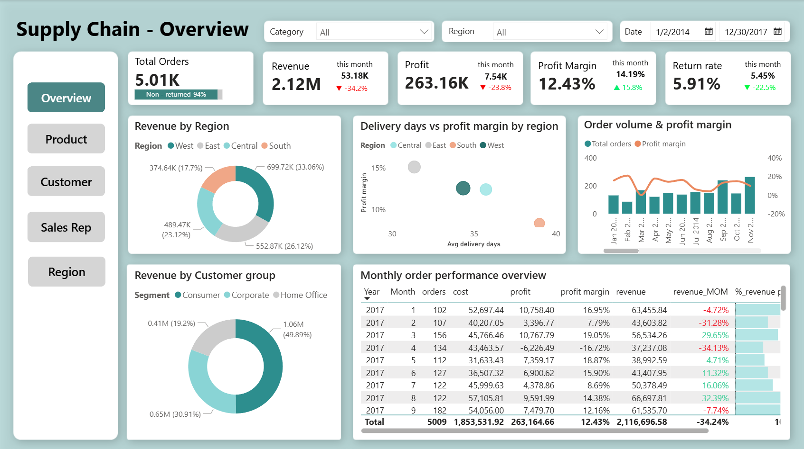

# Supply Chain & Sales Performance Dashboard (Power BI)

Interactive Power BI dashboard for **Supply Chain & Sales** analysis (2014–2017), focusing on **Revenue/Profit**, **Delivery Performance**, **Return Rate**, and **Customer Behavior** to support operational decisions.

**Quick links**
- Report file: `powerbi/SupplyChain_Dashboard.pbix`
- Data model: `assets/data_model.png`
- Docs: `docs/` (KPI, DAX, Model Notes, Refresh Guide, Data Dictionary)

---

## 1) Business Context
Supply chain operations directly impact revenue growth and operational efficiency for retail businesses. This project analyzes real-world order, customer, product, and regional sales data to evaluate key metrics like delivery times, return rates, profitability, and sales performance. Interactive Power BI dashboards enable stakeholders to monitor logistics, identify bottlenecks, and drive data-informed strategic decisions.

---

## 2) Project Objectives
Using Power BI, this project delivers:

- **Revenue & Profit performance** over time (year/quarter/month) and across Region, Product, Segment
- **Delivery performance monitoring** using Avg Delivery Days, shipping modes, and delivery-time patterns
- **Return-rate analysis** to identify high-risk Regions and Product groups (and prioritize investigation)
- **Customer & segment contribution** to revenue and repeat behavior indicators
- **Seasonality detection** for peak/low periods to guide inventory and logistics planning
- **Revenue forecasting** (next quarter) using Power BI’s built-in ETS forecasting
- Translate findings into **actionable recommendations** to improve service level and profitability

---

## 3) Dataset & Data Source
This report is built from a public challenge dataset published by **MazHoc Data**.

- Challenge page (overview + dataset download): `https://mazhocdata.tv/showcase/`
- Dataset name: **Supply Chain & Sales Performance Dataset** (2014–2017)

> **Important (PBIX behavior)**
> - The uploaded **PBIX is viewable immediately** using the cached model + data inside the file.
> - If you want to **refresh / reproduce from the original dataset**, follow the step-by-step guide in `docs/Refresh_Guide.md`.

---

## 4) Data Grain & Definitions (to avoid confusion)
Although the dataset includes both *Order ID* and *Retail Order ID*, visuals may behave differently depending on which identifier is used.

**This project uses the following convention:**
- **Line-item grain (Fact table):** 1 row per `Retail Order ID`  
- **Order-level counting (when needed):** use `Order ID`

**Recommended KPIs for clarity**
- **Total Line Items** = DISTINCTCOUNT(`Retail Order ID`)
- **Total Orders** = DISTINCTCOUNT(`Order ID`)

---

## 5) Data Model (Star-like Schema)
**Fact table**
- `fact_retail_order`: Sales, Profit, Cost, Discount, Quantity, Days, Returned + keys to dimensions

**Dimensions**
- `dim_calendar` (Date)
- `dim_customer` (+ Segment)
- `dim_product` (+ Category, Sub-category)
- `dim_address` (Region/State/City/Postal Code)
- `dim_ship_mode`
- `dim_retail_sales_people` (Sales Rep)
- `dim_return` (Returned status)

📌 Model diagram: `assets/data_model.png`  
📌 Model explanation (incl. snowflake rationale if any): `docs/Data_Model_Notes.md`

---

## 6) KPI Definitions (Core)
Core KPIs used across the report:
- **Revenue** = SUM(`Sales`)
- **Profit** = SUM(`Profit`)
- **Profit Margin** = Profit / Revenue
- **Avg Delivery Days** = AVERAGE(`Days`)
- **Returned Line Items** = COUNT rows where Returned = "Yes"
- **Return Rate (Line)** = Returned Line Items / Total Line Items

Optional (Order-level) KPIs:
- **Returned Orders** = DISTINCTCOUNT(`Order ID`) where Returned = "Yes"
- **Return Rate (Order)** = Returned Orders / Total Orders

📌 KPI documentation:
- `docs/KPI_Definitions.md`
- `docs/Key_DAX_Measures.md`

---

## 7) Analytical Questions (per challenge requirement)
1. Average delivery time? Which region has slowest deliveries?
2. How does delivery time impact profitability?
3. Which region has the highest return rate?
4. Which product has the highest return rate & key causes?
5. Revenue and profit trends over time (year/quarter/month)?
6. Top 5 regions highest/lowest revenue?
7. Products highest/lowest sales?
8. Which customer segment contributes most to total revenue?
9. Seasonality: peak vs low sales periods?
10. Forecast next quarter revenue?

---

## 8) Dashboard Pages (What’s inside)
### 8.1 Overview
Executive view of:
- Revenue, Profit, Profit Margin, Return Rate, Orders/Line items
- Revenue mix by segment & region
- Delivery days vs profitability patterns
- Monthly performance table + MoM indicators

Screenshot: `assets/page_overview.png`

### 8.2 Product
- Cost vs Profit by Category (margin risk)
- Pareto (80/20) for revenue concentration
- Return drivers by Sub-category (ranking)

Screenshot: `assets/page_product.png`

### 8.3 Customer
- Customer base size + avg revenue/orders/products per customer
- Segment contribution
- Customer retention cohort view (repeat behavior)

Screenshot: `assets/page_customer.png`

### 8.4 Sales Representative
- Trend by rep
- Revenue & margin by rep
- Return rate comparison with fair baseline
- Performance table (QTD, QoQ, YTD)

Screenshot: `assets/page_sales_rep.png`

### 8.5 Region
- Return rate & avg delivery days by region
- Revenue mix by category across regions
- Geo distribution + drill-down tables (Region → City)

Screenshot: `assets/page_region.png`

### 8.6 Drill-through Tooltips (Root-cause style)
Dedicated tooltip page(s) to explain drivers of return-rate for the current filter context:
- Return rate delta vs baseline
- Breakdown by Sub-category
- Breakdown by Region / Segment / Delivery-days bucket

✅ **Baseline definition (“Overall”)**
- **Overall removes ONLY the Sales Rep filter**
- Other slicers remain applied (Date/Region/Category/Ship mode...), ensuring a fair comparison

Tooltip screenshot: `assets/tooltip_sales_rep.png`

### 8.7 Forecast Revenue
- Built-in forecasting (ETS) with confidence interval
- Used for planning inventory and logistics capacity

Screenshot: `assets/forecast_revenue.png`

---

## 9) Key Insights (summary)

- **Overall performance:** Total revenue ~**2.30M**, total profit ~**286K**, profit margin ~**12.47%**, overall return rate ~**5.91%**.
- **Delivery performance:** Average delivery time is ~**34 days**. **Central** is the slowest (~**35.9 days**) and **West** is the fastest (~**32.0 days**).
- **Delivery time vs profitability:** Profitability tends to **decline and become more volatile** as delivery time increases, indicating operational delays can pressure margins.
- **Returns (hotspots):** **West** has the highest return rate (~**10.9%**), significantly higher than other regions (~3%).
- **High-return products:** Highest return-rate sub-categories are **Machines (~11.5%)** and **Tables (~9.7%)**.
- **Revenue concentration by region:** **West (~764.6K)** > **East (~611.7K)** > **Central (~518.8K)** > **South (~402.0K)**.
- **Product mix:** Revenue is highly concentrated (Pareto pattern). Sub-categories such as **Phones, Chairs, Storage, Tables, and Binders** contribute the majority of sales, while **Fasteners, Labels, and Envelopes** are among the lowest.
- **Customer segment contribution:** **Consumer** is the largest segment, contributing ~**50.56%** of total revenue.
- **Seasonality & forecast:** Sales show clear seasonality with recurring peaks/troughs; the next quarter forecast suggests continued growth at roughly **~170K–190K** total (depending on confidence intervals).

---

## 10) Recommendations
### Short-term (0–3 months)
- Implement a **Return Watchlist**: rank items by `Return Rate × Revenue` (focus first on hotspots such as **West** and high-return sub-categories like **Machines/Tables**).
- Set **alert thresholds** (e.g., return rate > baseline + configurable parameter; delivery days above the **delivery time target**).
- Run **operational checks** for high-return buckets: packaging integrity, shipping damage, product expectation mismatch, and QA sampling.
- Track a “**High Return + Low Margin**” view to prioritize cases that hurt both service quality and profitability.

### Mid-term (3–6 months)
- Review **pricing/discount policy** where margin is fragile (apply margin guardrails; reassess discounting in low-margin categories).
- Improve **delivery reliability** for lanes/segments correlated with higher return risk (optimize ship mode, fulfillment process, and set **region-level delivery time targets**).
- Add a **“reason for return”** field (if available) to validate root causes and quantify the biggest drivers.

### Next data enhancements
- Add **carrier/warehouse + shipment event logs** (planned vs actual) to explain delivery-day variance.
- Capture **return reason + product condition + refund/exchange outcome** to distinguish defect vs logistics vs preference returns.
- Add **customer lifetime value / repeat rate** to quantify churn risk and prioritize retention actions.

---

## 11) How to View / Run
### View (no dataset needed)
1. Download `powerbi/SupplyChain_Dashboard.pbix`
2. Open in Power BI Desktop  
➡️ You can explore the report immediately using the cached model/data.

### Refresh (optional)
To refresh from the original public dataset:
- Follow `docs/Refresh_Guide.md`

---

## 12) Repository Structure
- `powerbi/` : PBIX report
- `assets/`  : dashboard screenshots + data model diagram
- `docs/`    : KPI definitions, DAX measures, model notes, refresh guide, data dictionary

---

## 13) Tools & Skills
**Power BI**, **Power Query (ETL)**, **DAX**, **Dimensional Modeling**, **Supply Chain Analytics**, **Data Visualization**
